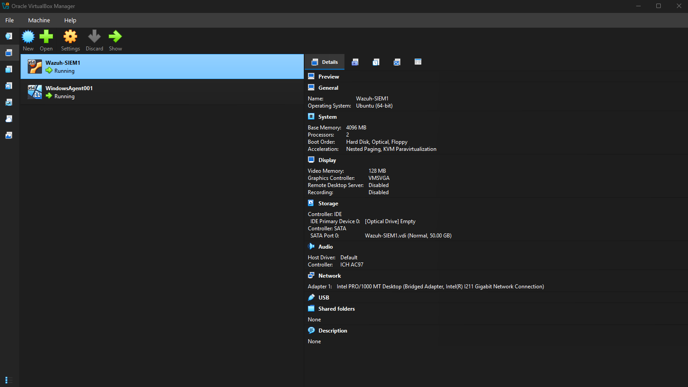
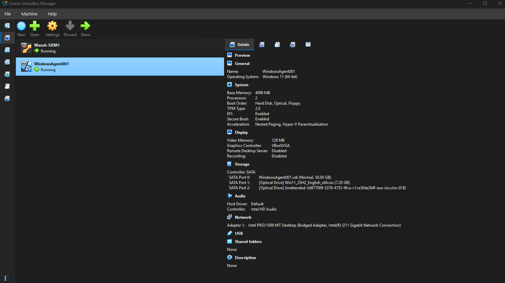
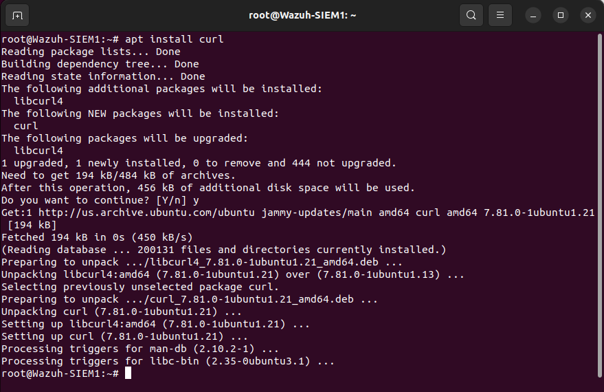
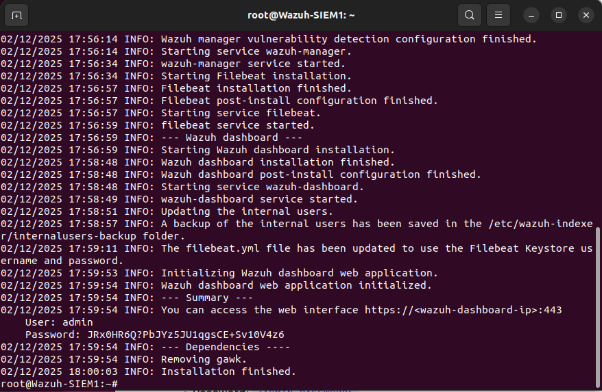
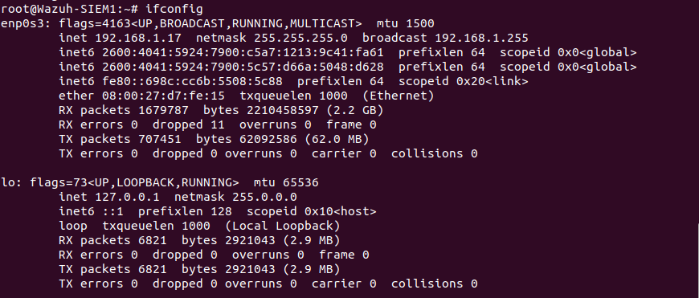
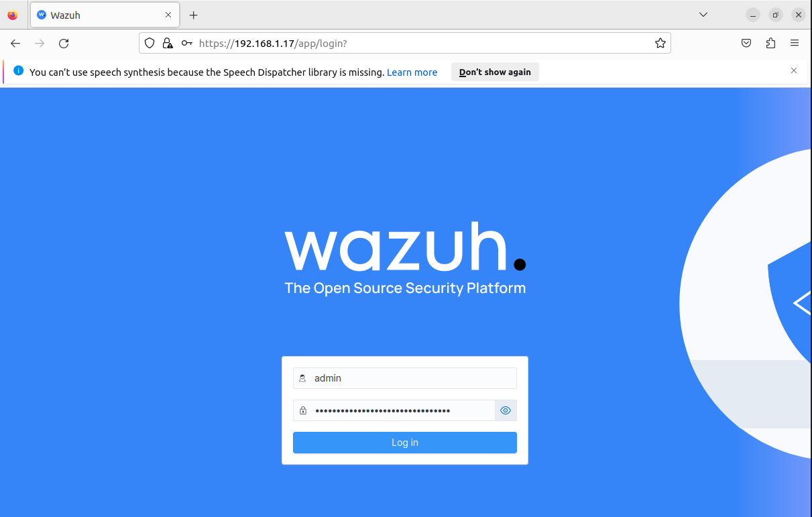
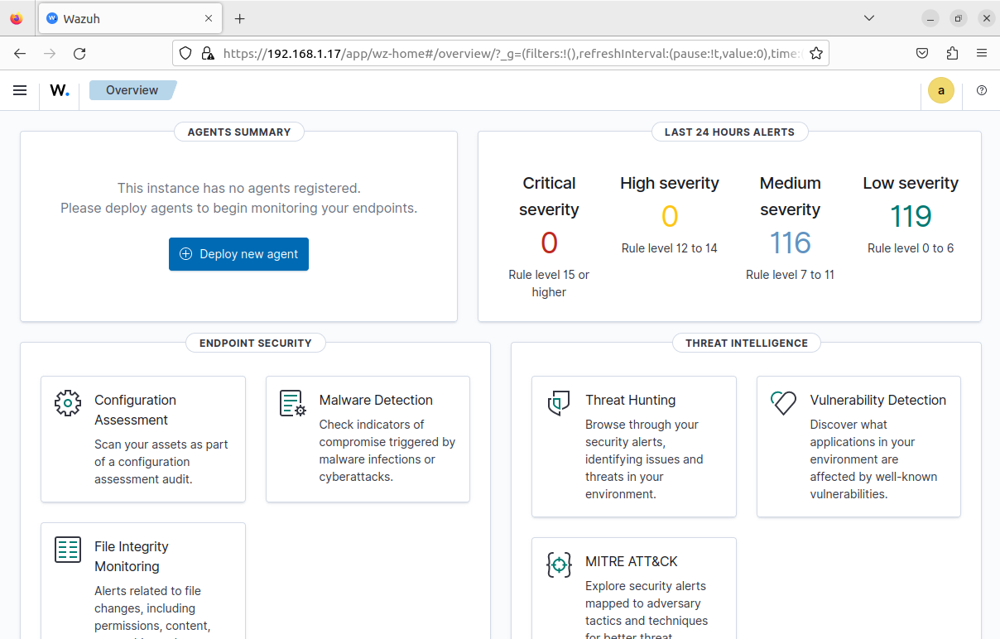
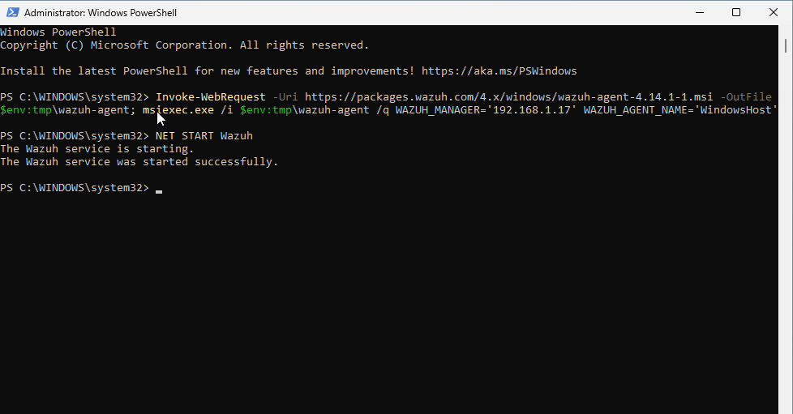

# Wazuh SIEM Setup Project

## Project Description
Documentation of setting up a Wazuh SIEM server with Ubuntu and Windows 11 agent using VirtualBox VMs.

## VirtualBox VM Configuration

### Wazuh-SIEM1 (Ubuntu Server)

- **Name**: Wazuh-SIEM1
- **OS**: Ubuntu (64-bit)
- **Memory**: 4096 MB
- **Storage**: 50.00 GB
- **Network**: Bridged Adapter (Intel PRO/1000 MT Desktop)
- **Status**: Running

### WindowsAgent001 (Windows 11 Agent)

- **Name**: WindowsAgent001
- **OS**: Windows 11 (64-bit)
- **Memory**: 4094 MB
- **Storage**: 50.30 GB
- **Network**: Bridged Adapter (Intel PRO/1000 MT Desktop)
- **Boot Media**: Windows 11 ISO mounted
- **Status**: Running

## Installation Steps Documentation

### Step 1: VirtualBox VM Setup
- Created two VMs in Oracle VirtualBox
- Both configured with bridged networking for same subnet communication
- Ubuntu server: 50GB disk, 4GB RAM
- Windows 11 client: 50GB disk, 4GB RAM

### Step 2: Install curl on Ubuntu Server

- Command: `apt install curl`
- Purpose: To download Wazuh installation assistant

### Step 3: Install Wazuh Server

- Command: `curl -sO https://packages.wazuh.com/4.14/wazuh-install.sh && sudo bash ./wazuh-install.sh -a`
- Output: Shows installation progress of Wazuh components
- Credentials provided: Username: admin, Password: JRxQHR6Q?PbJYz5JU1qgsCE+Sv10V426

### Step 4: Find Server IP

- Command: `ifconfig`
- Server IP: 192.168.1.17
- Interface: enp0s3

### Step 5: Access Wazuh Dashboard

- URL: https://192.168.1.17:443
- Successful login with provided credentials

### Step 6: Initial Empty Dashboard

- No agents registered initially
- Message: "This instance has no agents registered"

### Step 7: Install Windows Agent

- PowerShell commands used:
  ```powershell
  Invoke-WebRequest -Uri https://packages.wazuh.com/4.x/windows/wazuh-agent-4.14.1-1.msi -OutFile $env:tmp\wazuh-agent
  msiexec.exe /i $env:tmp\wazuh-agent /q WAZUH_MANAGER='192.168.1.17' WAZUH_AGENT_NAME='WindowsAgent001'
  NET START Wazuh
